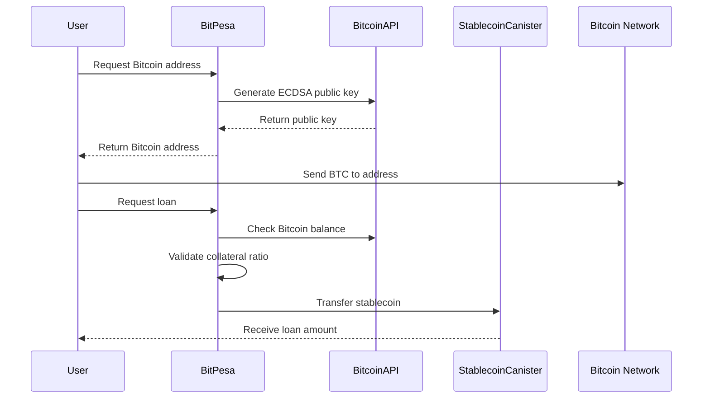

# BitPesa: Bitcoin DeFi Platform on Internet Computer

BitPesa leverages ICP's native Bitcoin integration to create a decentralized lending platform where users can deposit native Bitcoin as collateral and borrow stablecoins without relying on bridges or oracles.

## 🚀 Key Features

### Native Bitcoin Integration
- **Direct Bitcoin Custody**: Hold actual Bitcoin using ICP's threshold ECDSA
- **No Bridges Required**: Direct integration with Bitcoin network through ICP protocol
- **Threshold Signing**: Secure Bitcoin transactions using distributed key generation
- **Real-time Bitcoin Data**: Query Bitcoin network state directly from smart contracts

### DeFi Lending Platform
- **Bitcoin Collateral**: Use native Bitcoin (not wrapped tokens) as collateral
- **Stablecoin Loans**: Borrow ICRC-1 compliant stablecoins against Bitcoin
- **Automated Liquidation**: Real-time price monitoring and liquidation
- **Competitive Rates**: Transparent interest rates and fees

## 🏗️ Architecture Overview

```
┌─────────────────┐    ┌──────────────────┐    ┌─────────────────┐
│   Bitcoin       │    │   ICP Canister   │    │   ICRC-1        │
│   Network       │◄──►│   (BitPesa)      │◄──►│   Stablecoin    │
│                 │    │                  │    │   Canister      │
└─────────────────┘    └──────────────────┘    └─────────────────┘
         ▲                        ▲
         │                        │
         ▼                        ▼
┌─────────────────┐    ┌──────────────────┐
│   Threshold     │    │   Bitcoin API    │
│   ECDSA API     │    │   (ICP Native)   │
└─────────────────┘    └──────────────────┘
```

## 🔧 Technical Implementation

### Bitcoin Integration Components

1. **Threshold ECDSA Key Management**
   - Generate unique Bitcoin addresses for each user
   - Sign Bitcoin transactions using distributed private keys
   - Support for both mainnet and testnet

2. **Bitcoin API Integration**
   - Query Bitcoin network state (balances, UTXOs, fees)
   - Submit transactions directly to Bitcoin network
   - Real-time Bitcoin data without external oracles

3. **UTXO Management**
   - Automatic UTXO selection for transactions
   - Fee calculation based on current network conditions
   - Change address management

### Smart Contract Workflow



## 🚀 Getting Started

### Prerequisites

- [DFX SDK](https://internetcomputer.org/docs/current/developer-docs/setup/install/) >= 0.15.0
- [Node.js](https://nodejs.org/) >= 18.0.0 (for frontend integration)
- Bitcoin testnet access (for testing)

### Installation

1. **Clone the repository**
   ```bash
   git clone https://github.com/bl4ckh402/bitpesa
   cd bitpesa
   ```

2. **Start local ICP replica**
   ```bash
   dfx start --clean --background
   ```

3. **Deploy the canisters**
   ```bash
   dfx deploy
   ```

### Configuration

Update `dfx.json` to enable Bitcoin integration:

```json
{
  "defaults": {
    "bitcoin": {
      "enabled": true,
      "log_level": "info",
      "nodes": ["127.0.0.1:18444"]
    }
  }
}
```

## 📖 Usage Examples

### 1. Generate Bitcoin Address

```motoko
// Generate a unique Bitcoin address for a user
let result = await bitpesa.generateUserBitcoinAddress();
switch (result) {
  case (#ok(address)) {
    Debug.print("Your Bitcoin address: " # address);
  };
  case (#err(error)) {
    Debug.print("Error: " # debug_show(error));
  };
};
```

### 2. Check Bitcoin Balance

```motoko
// Check user's Bitcoin balance
let balance = await bitpesa.getUserBitcoinBalance();
switch (balance) {
  case (#ok(satoshis)) {
    Debug.print("Balance: " # debug_show(satoshis) # " satoshis");
  };
  case (#err(error)) {
    Debug.print("Error: " # debug_show(error));
  };
};
```

### 3. Create a Bitcoin-Collateralized Loan

```motoko
// Create a loan using Bitcoin as collateral
let loanResult = await bitpesa.createBitcoinLoan(
  1_000_000,  // 0.01 BTC in satoshis
  500_000,    // 500 USDC (assuming 6 decimals)
  30          // 30 days duration
);

switch (loanResult) {
  case (#ok(loanId)) {
    Debug.print("Loan created with ID: " # debug_show(loanId));
  };
  case (#err(error)) {
    Debug.print("Loan creation failed: " # debug_show(error));
  };
};
```

### 4. Frontend Integration

```typescript
// Frontend integration with auth-client
import { bitPesaService } from './bitpesa-service';

async function createBitcoinLoan() {
  try {
    // Generate Bitcoin address
    const address = await bitPesaService.generateUserBitcoinAddress();
    console.log('Send Bitcoin to:', address);
    
    // Wait for Bitcoin deposit
    const balance = await bitPesaService.getUserBitcoinBalance();
    console.log('Current balance:', balance);
    
    // Create loan
    const loanId = await bitPesaService.createBitcoinLoan(
      100000,   // 0.001 BTC
      50000,    // 50 USDC
      30        // 30 days
    );
    
    console.log('Loan created:', loanId);
  } catch (error) {
    console.error('Error:', error);
  }
}
```

## 🔐 Security Features

### Threshold Cryptography
- **Distributed Key Generation**: No single point of failure for private keys
- **Threshold Signatures**: Require consensus from multiple nodes to sign transactions
- **Secure Key Derivation**: Unique keys per user using deterministic derivation

### Smart Contract Security
- **Access Controls**: Role-based permissions for administrative functions
- **Input Validation**: Comprehensive validation of all user inputs
- **Overflow Protection**: Safe arithmetic operations throughout
- **Liquidation Protection**: Automatic liquidation to protect lenders

### Bitcoin Network Security
- **Confirmation Requirements**: Configurable confirmation thresholds
- **Fee Market Integration**: Dynamic fee calculation based on network conditions
- **UTXO Management**: Secure UTXO selection and change handling

## 🧪 Testing

### Unit Tests

```bash
# Run Motoko unit tests
dfx canister call bitpesa_backend test_bitcoin_integration
```

### Integration Tests

```bash
# Test with Bitcoin testnet
dfx canister call bitpesa_backend demo_complete_workflow
```

### Frontend Tests

```bash
# Run frontend tests
npm test
```

## 📊 Monitoring and Analytics

### Platform Metrics

```motoko
// Get platform statistics
let stats = await bitpesa.getPlatformStats();
// Returns: total loans, collateral amounts, outstanding debt, etc.
```

### User Analytics

```motoko
// Get user's loan history
let userLoans = await bitpesa.getUserLoans(userPrincipal);
// Returns: all loans for a specific user
```

## 🚨 Risk Management

### Collateral Requirements
- **Minimum Collateral Ratio**: 150% (configurable)
- **Liquidation Threshold**: 125% (configurable)
- **Safety Margins**: Built-in buffers to account for price volatility

### Price Oracle Reliability
- **Multiple Data Sources**: Coinbase, Binance, Kraken APIs
- **Fallback Mechanisms**: Graceful degradation if primary oracle fails
- **Price Validation**: Cross-reference multiple sources

### Liquidation Mechanisms
- **Automated Monitoring**: Continuous price monitoring using timers
- **Fair Liquidation**: Market-based liquidation prices
- **Liquidation Incentives**: Rewards for liquidators to ensure system health

## 🔄 Upgrade and Governance

### Canister Upgrades
- **Stable Memory**: Preserve state across upgrades
- **Migration Scripts**: Automated data migration for schema changes
- **Rollback Capability**: Safe rollback mechanisms

### Governance
- **Parameter Updates**: On-chain voting for system parameters
- **Emergency Controls**: Circuit breakers for extreme market conditions
- **Community Oversight**: Transparent governance process

## 🌐 Network Configuration

### Mainnet Deployment
```bash
# Deploy to mainnet
dfx deploy --network ic --with-cycles 1000000000000
```

### Testnet Configuration
```json
{
  "networks": {
    "testnet": {
      "providers": ["https://testnet.dfinity.network"],
      "type": "ephemeral"
    }
  }
}
```

## 📚 API Reference

### Core Functions

#### `generateUserBitcoinAddress() : async Result<Text, AppError>`
Generate a unique Bitcoin address for the calling user.

#### `getUserBitcoinBalance() : async Result<Satoshi, AppError>`
Check the Bitcoin balance for the user's address.

#### `depositBitcoinCollateral() : async Result<Satoshi, AppError>`
Record Bitcoin deposits as collateral (after user sends BTC to their address).

#### `createBitcoinLoan(collateral: Satoshi, loan: Nat, duration: Nat) : async Result<LoanId, AppError>`
Create a new loan using Bitcoin collateral.

#### `repayLoan(loanId: LoanId) : async Result<Null, AppError>`
Repay a loan and release collateral.

### Query Functions

#### `getLoan(loanId: LoanId) : async ?Loan`
Get details for a specific loan.

#### `getUserLoans(user: Principal) : async [Loan]`
Get all loans for a specific user.

#### `getPlatformStats() : async PlatformStats`
Get overall platform statistics.

## 🤝 Contributing

1. Fork the repository
2. Create a feature branch: `git checkout -b feature/amazing-feature`
3. Commit your changes: `git commit -m 'Add amazing feature'`
4. Push to the branch: `git push origin feature/amazing-feature`
5. Open a pull request

## 📄 License

This project is licensed under the MIT License - see the [LICENSE](LICENSE) file for details.

## 🔗 Resources

- [Internet Computer Documentation](https://internetcomputer.org/docs/)
- [Bitcoin Integration Guide](https://internetcomputer.org/docs/current/developer-docs/integrations/bitcoin/)
- [Threshold ECDSA Documentation](https://internetcomputer.org/docs/current/developer-docs/integrations/t-ecdsa/)
- [ICRC-1 Token Standard](https://github.com/dfinity/ICRC-1)

## 📧 Support

- **Discord**: [Join our community](https://discord.gg/bitpesa)
- **Telegram**: [@bitpesa_support](https://t.me/bitpesa_support)
- **Email**: support@bitpesa.io

---

**⚠️ Disclaimer**: This software is in active development. Use at your own risk. Never deposit more Bitcoin than you can afford to lose.
